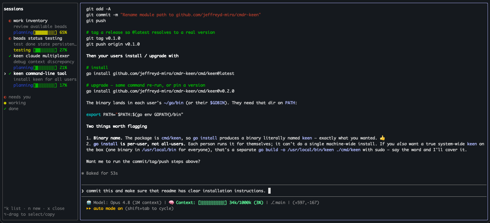

# keen

A thin multiplexer for Claude Code. Run many `claude` sessions behind one
screen: a fixed-order sidebar showing each session's name and a live status
color (crunching / waiting on you / all done), plus an embedded pane for the
active session. Keystrokes pass straight through to Claude — keen only adds the
list, the names, and the statuses.



See [`docs/spec.md`](docs/spec.md) for the full design and milestones.

## Install

With a Go toolchain (1.26+), install the `keen` binary straight from the repo:

```sh
go install github.com/jeffreyd-miro/cmdr-keen/cmd/keen@latest
```

This drops `keen` into your `$GOBIN` (defaults to `~/go/bin`). Make sure that
directory is on your `PATH`:

```sh
export PATH="$PATH:$(go env GOPATH)/bin"
```

To **upgrade** later, re-run the same command, or pin a specific release:

```sh
go install github.com/jeffreyd-miro/cmdr-keen/cmd/keen@latest   # newest tag
go install github.com/jeffreyd-miro/cmdr-keen/cmd/keen@v0.1.0   # a fixed version
```

`go install` is per-user — every user runs it for themselves. To install once
for **all** users on a machine, install it as yourself and copy the binary into
a shared directory on the system `PATH`:

```sh
go install github.com/jeffreyd-miro/cmdr-keen/cmd/keen@latest
sudo cp "$(go env GOPATH)/bin/keen" /usr/local/bin/keen
```

### Build from source

Build **both** binaries into `bin/` — keen locates the hook helper next to
itself:

```sh
go build -o bin/keen ./cmd/keen
go build -o bin/cc-deck-hook ./cmd/cc-deck-hook
```

## Run

```sh
keen                # one session: `claude --permission-mode auto` in $PWD
keen -- bash        # wrap an arbitrary command instead (handy for testing)
```

(If you built from source instead of installing, run `./bin/keen`.)

Each session is spawned with hooks injected via `claude --settings <tempfile>`,
so your global `~/.claude` is never modified.

## Controls

| Action | Key |
|---|---|
| Toggle focus: sidebar ⇄ session | **Ctrl-K** (or **Cmd-K**, see setup below) |
| Move selection (sidebar focused) | `j`/`k` or ↑/↓ |
| Jump into the session | `Enter` |
| New session | `n` |
| Close session | `x` |
| Jump to session N | `1`–`9` |
| Quit keen | `q` |
| Switch to a session | click its row |

When the session is focused, everything (typing, paste, mouse scroll/click) goes
straight to Claude. Only the prefix key is intercepted.

### Copying and pasting

Because keen captures the mouse for the session, a normal click-drag won't
select text — it gets sent to Claude. To select and copy text, **hold Option
while you drag** (on most macOS terminals this bypasses mouse capture and does a
native text selection); then copy as usual.

You can **drag files into** the session to insert their paths, but **pasting
files in may not work** — drag them in instead.

## Status colors

| Glyph | Meaning | Hook event |
|---|---|---|
| `·` grey | starting | `SessionStart` |
| `●` yellow | crunching | `UserPromptSubmit`, `PreToolUse` |
| `◐` red | waiting on you | `Notification` |
| `✓` green | all done (your move) | `Stop` |
| `✕` faint | exited | `SessionEnd` |

## Setup: make Cmd-K work too (macOS / Cursor / VS Code)

keen's prefix is **Ctrl-K**. To also trigger it with **Cmd-K**, the terminal
must be told to send the Ctrl-K byte on Cmd-K — macOS terminals swallow the Cmd
modifier, so a terminal program can't see Cmd-K on its own.

Add this to your Cursor/VS Code `keybindings.json`
(`Cmd-Shift-P` → *Preferences: Open Keyboard Shortcuts (JSON)*):

```jsonc
{
  "key": "cmd+k",
  "command": "workbench.action.terminal.sendSequence",
  "args": { "text": "\u000b" },   // \u000b = Ctrl-K
  "when": "terminalFocus"
}
```

Trade-offs while the terminal is focused: this overrides Cmd-K's default
"clear terminal" and any Cmd-K chord shortcuts, and in a non-keen shell Cmd-K
will send Ctrl-K (kill-to-end-of-line). It only applies when the terminal has
focus.

> On macOS this file lives at
> `~/Library/Application Support/Cursor/User/keybindings.json` (Cursor) or
> `.../Code/User/keybindings.json` (VS Code).

## Layout

```
cmd/keen/            entry point
cmd/cc-deck-hook/    tiny Claude Code hook helper (reports status to keen)
internal/session/    one claude process: PTY + terminal emulator + lifecycle
internal/ui/         Bubble Tea model, sidebar/pane render, key + mouse input
internal/hooks/      unix-socket status server + per-session settings generation
internal/titler/     turns a session's first prompt into a short Haiku tab title
spike/               M0 de-risk spikes (passthrough vs embedded-vt)
```
